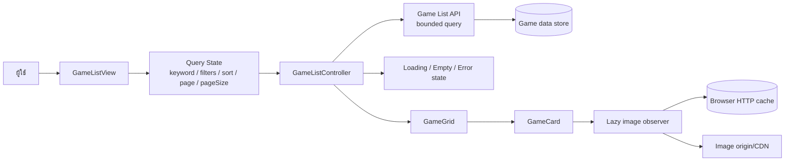

# Game List Optimization Design

## Overview

ระบบจะปรับหน้า game list โดยคงการโหลดรายการทั้งหมดและ search/filter/sort ฝั่ง client ไว้ ใช้การโหลดรูปแบบ lazy loading พร้อม placeholder และพึ่งพา browser HTTP cache เป็นหลัก โดยแยกสถานะ loading, success, empty และ error อย่างชัดเจน

## Architecture



### Component breakdown

- `GameListView`: ถือ query state, เริ่มโหลดข้อมูล, และเลือก state ที่จะแสดง
- `GameListController` หรือ service layer: สร้าง request, ยกเลิก/ละทิ้ง response ที่เก่า และแปลง response เป็น view model
- `GameGrid`: แสดงการ์ดเฉพาะรายการในหน้าปัจจุบัน
- `PaginationControl`: แสดงเลขหน้า/ช่วงรายการ และควบคุมปุ่มก่อนหน้า/ถัดไป
- `GameCardImage`: ใช้ `loading="lazy"` หรือ `IntersectionObserver`, placeholder และ fallback
- `SkeletonGrid`: แสดงจำนวน skeleton เท่ากับจำนวนรายการต่อหน้า
- `EmptyState` / `ErrorState`: แสดงข้อความและ action ที่เหมาะสม

## Components and Interfaces

### Query and response DTOs

```text
GameListQuery {
  keyword?: string
  filters?: Record<string, string | string[]>
  sort?: string
  page: number          // เริ่มที่ 1
  pageSize: number      // ค่าที่อนุญาต เช่น 24 หรือ 48
}

GameListItem {
  id: string | number
  title: string
  imageUrl?: string
  imageVersion?: string
  metadata?: Record<string, unknown>
}

GameListResponse {
  items: GameListItem[]
  page: number
  pageSize: number
  totalItems: number
  totalPages: number
}
```

### Service methods

```text
getGames(query: GameListQuery): Promise<GameListResponse>
loadGameListImage(imageUrl: string): Promise<void>
retryGameList(query: GameListQuery): Promise<GameListResponse>
```

API ต้องรับ `page`, `pageSize` และเงื่อนไขค้นหา/กรอง/เรียงลำดับใน request เดียวกัน และต้องไม่ fallback ไปดึงข้อมูลทั้งหมดเพื่อแบ่งหน้าใน client

### State model

```text
GameListState =
  idle
  | loading { query: GameListQuery }
  | success { response: GameListResponse }
  | empty { query: GameListQuery }
  | error { query: GameListQuery, message: string }
```

การเปลี่ยน query จาก keyword, filter หรือ sort ต้องตั้ง `page = 1` ก่อนเรียก `getGames` ใหม่ ส่วนการเปลี่ยนหน้าให้คงเงื่อนไขเดิมไว้

## Data Models

ไม่เพิ่มตารางหรือเปลี่ยน schema จาก requirement นี้ โดยใช้ข้อมูลเกมเดิมและ contract เดิมของ `watchAll()`

Pagination ถูกตัดออกจาก scope ตามการตัดสินใจล่าสุดของผู้ใช้

- Query data: `keyword`, filters, sort, `page`, `pageSize`
- Result data: `items`, `totalItems`, `totalPages`, `page`, `pageSize`
- Image identity: `imageUrl` ต้องระบุเกมได้ถูกต้อง และ `imageVersion` หรือ hash ใช้ทำ cache invalidation เมื่อรูปเปลี่ยน
- หาก endpoint อ่านจากฐานข้อมูล ควรมี index ตามฟิลด์ค้นหา/กรอง/เรียงที่ใช้งานจริง โดยยืนยันจาก schema ก่อนแก้ไข

## Correctness Properties

- ทุก request ที่แสดงผลต้องมี `page >= 1` และ `pageSize` อยู่ในค่าที่ระบบอนุญาต (อ้างอิง 1.1, 1.6)
- `items` ที่แสดงต้องเป็นผลจาก query ล่าสุดเท่านั้น และต้องไม่ปะปนกับ response ของหน้า/คำค้นก่อนหน้า (อ้างอิง 1.3, 1.5, 5.2)
- `totalPages = ceil(totalItems / pageSize)` เมื่อ `pageSize > 0` และปุ่ม pagination ต้องสะท้อนขอบเขตนี้ (อ้างอิง 1.2, 1.4)
- เมื่อ query เปลี่ยน หน้าเริ่มต้นต้องเป็นหน้า 1 เสมอ (อ้างอิง 1.5)
- การโหลดรูปต้องไม่เป็นเงื่อนไขที่ทำให้ข้อมูลข้อความของการ์ดแสดงไม่ได้ (อ้างอิง 2.5)
- รูปที่ URL/version เดียวกันต้องสามารถใช้ cache ร่วมกันได้ และเมื่อ version เปลี่ยนต้องไม่ใช้รูปเก่าแทนรูปใหม่ (อ้างอิง 3.1–3.4)
- ทุกสถานะ loading ต้องจบด้วย success, empty หรือ error และต้องไม่ค้าง skeleton (อ้างอิง 4.4, 4.5)

## Error Handling

| สถานการณ์ | พฤติกรรมที่คาดหวัง |
|---|---|
| เปิดหน้าครั้งแรก | แสดง `SkeletonGrid` และปิดการควบคุมที่ทำให้เกิด request ซ้อน |
| เปลี่ยนหน้า | แสดง loading ของรายการใหม่ คง query เดิม และละทิ้ง response ที่ไม่ใช่ request ล่าสุด |
| คำค้นไม่พบข้อมูล | แสดง `EmptyState` พร้อมข้อความว่าไม่พบเกมตามเงื่อนไข |
| ไม่มีเกมในระบบ | แสดง empty state ที่เหมาะสม ไม่แสดง grid ว่าง |
| API/เครือข่ายล้มเหลว | ซ่อน skeleton แสดง `ErrorState` และปุ่มลองใหม่ |
| response ไม่ถูกต้องหรือ total ไม่สอดคล้อง | ไม่แสดง pagination ที่คำนวณไม่ได้ และแสดง error state |
| รูปโหลดไม่สำเร็จ | ใช้ fallback image เฉพาะการ์ดนั้น |
| browser/application cache ใช้งานไม่ได้ | โหลดจาก image origin ต่อได้โดยไม่ทำให้ game list ล้มเหลว |
| รายการถูกลบจนหน้าปัจจุบันไม่มีข้อมูล | ปรับไปหน้าสุดท้ายที่ยังมีอยู่แล้วโหลดใหม่ หรือแสดง empty state หากไม่เหลือข้อมูล |

## Caching Strategy

ใช้ browser HTTP cache เป็นชั้นหลัก โดย image origin/CDN ควรส่ง header สำหรับรูปที่ immutable เช่น `Cache-Control: public, max-age=31536000, immutable` รูปที่เปลี่ยนต้องเปลี่ยน `imageVersion` หรือ URL hash เพื่อทำ cache busting ไม่ใช้ `localStorage` เป็นที่เก็บ binary รูปภาพ

Lazy loading จะเริ่มโหลดเมื่อรูปอยู่ใกล้ viewport และต้องกำหนดขนาดพื้นที่รูปไว้ล่วงหน้าเพื่อป้องกัน layout shift หากใช้ Service Worker ในอนาคต ให้เป็น opt-in เพิ่มเติมและต้องมีนโยบาย eviction ไม่ให้ cache โตไม่จำกัด

## Verification

การตรวจสอบหลักเป็น manual verification:

- [ ] เปิด game list ที่มีข้อมูลจำนวนมาก ตรวจใน Network ว่า request แรกมี `page/pageSize` และไม่ได้คืนข้อมูลทั้งหมด
- [ ] เปลี่ยนหน้า ตรวจว่ารายการไม่ซ้ำ/ไม่ปะปน และปุ่มก่อนหน้า/ถัดไปถูกต้อง
- [ ] ค้นหา/กรอง/เรียงจากหน้าอื่น ตรวจว่ากลับหน้า 1 และผลลัพธ์ไม่อิงเฉพาะหน้าที่โหลดไว้
- [ ] เลื่อนหน้า ตรวจว่ารูปนอก viewport ยังไม่ถูกโหลดจนกว่าจะเข้าใกล้ viewport
- [ ] กลับไปหน้าที่เคยดู ตรวจ Network ว่ารูปเดิมใช้ cache เมื่อเหมาะสม
- [ ] เปลี่ยน version/URL ของรูป ตรวจว่ารูปใหม่ถูกโหลดแทนรูปเก่า
- [ ] ตรวจ skeleton ตอนเปิดหน้าและตอนเปลี่ยนหน้า รวมถึงไม่เหลือ skeleton หลังโหลดเสร็จ
- [ ] ทดสอบ empty state, API error, retry และรูปเสีย
- [ ] ทดสอบการกดเปลี่ยนหน้าซ้ำเร็ว ๆ ว่าไม่เกิดรายการซ้ำหรือ response เก่าทับผลลัพธ์ใหม่
- [ ] ใช้ DevTools วัดเวลาโหลดและจำนวน request ก่อน/หลัง โดยทดสอบด้วยข้อมูลระดับใกล้เคียง production
