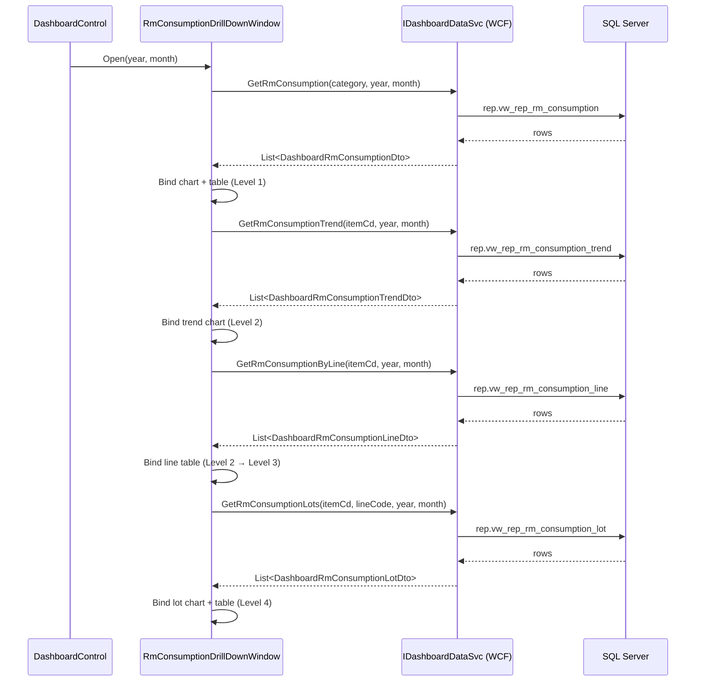

# Design Document: Chart 06 — Raw Material Consumption vs Standard

## Overview

Chart 06 adds a dashboard card and 4-level drill-down window to the FLEX WPF dashboard showing raw material actual consumption vs BOM-based standard usage for a selected Year + Month. Users can identify over-consuming materials, drill into the responsible production line and lot, and see the cost impact. Actual consumption and standard usage both come from **`TB_WORK_RESULT_TRANS_OUT_EXT`** (the material-issue table) — `QTY` is the actual consumed qty and `BOM_QTY` is the precomputed standard; business logic lives entirely in SQL views and the WCF service — no computation in code-behind.

> **⚠️ Revision 2026-06-22 — data-source pivot (supersedes the original draft below).**
> Schema verification against live `FLEX_EXT` found the original design pointed at the wrong table:
> - `TB_WORK_RESULT_TRANS_IN_EXT` records the **produced good** per work result, not raw-material consumption (genuine consumed rows there total 3 items across all history).
> - Header `PRODUCTION_QTY` is NULL in 89% of rows, so `(LOWER_QTY/UPPER_QTY) × PRODUCTION_QTY` is unusable.
> - The correct source is **`TB_WORK_RESULT_TRANS_OUT_EXT`**, which already carries `QTY` (actual), **`BOM_QTY` (standard, precomputed)**, `ISSUE_QTY`, `LOT_NO`, `CONSUMTION_CLS` per (work result, material).
> **Resolved with user:** ActualQty = `SUM(OUT.QTY)`, StandardQty = `SUM(OUT.BOM_QTY)`. The BOM-ratio formula is no longer used. `DELETEFLAG` values are `'0'`/`'1'` (filter `<> '1'`, **not** `<> 'Y'`). Category comes from `TBM_ITEMCATEGORY.DESCENG`. Unit cost = `TBM_COST_STANDARD_EXT.STANDARD_COST` (table empty today) → fallback to weighted movement average `SUM(PRICE*QTY)/SUM(QTY)` from `TB_INV_TRANS_TR` receipts (`IN_OUT_CLS='01'`), pre-aggregated per item to avoid join fan-out. The view column contracts in §1 and Data Models are updated to match; DTOs and UI are unaffected.

---

## Architecture

### Data Flow

```
SQL Server (FLEX_EXT)
  ├── TB_WORK_RESULT_TRANS_OUT_EXT (actual RM issued/consumed: QTY, BOM_QTY, LOT_NO)  ← primary source
  ├── TB_WORK_RESULT_TRANS_H_EXT   (work result header: line FR_LOC_CD, production date)
  ├── TB_ITEM_MS                   (item description, category id, unit)
  ├── TBM_ITEMCATEGORY             (category name DESCENG)
  ├── TBM_COST_STANDARD_EXT        (standard unit cost per item per year — empty today)
  └── TB_INV_TRANS_TR              (movement-avg unit-cost fallback: PRICE, QTY, IN_OUT_CLS)
        └── rep.vw_rep_rm_consumption_*   ← new reporting views (this feature)
              └── DashboardDataSvc.cs     ← 4 new service methods
                    └── IDashboardDataSvc (WCF)
                          └── RmConsumptionDrillDownWindow.xaml(.cs)
                                └── DashboardControl.xaml (card #06)
```

### Drill-down Navigation

```
DashboardControl (card #06)
  └── click → RmConsumptionDrillDownWindow
        ├── Level 1: All Materials  (Year+Month+Category filter)
        │     └── click row/bar → Level 2
        ├── Level 2: Single Material  (trend W1–W4 + line table)
        │     └── click row → Level 3
        ├── Level 3: Single Line  (lot-by-lot bar chart + table)
        │     └── click row/bar → Level 4
        └── Level 4: Single Lot  (comparison bar + lot info panel)
```

### Component Interaction



---

## Components and Interfaces

### 1. SQL Reporting Views (new — `rep` schema)

> Common source for all four views: `TB_WORK_RESULT_TRANS_OUT_EXT o` JOIN `TB_WORK_RESULT_TRANS_H_EXT h` ON `WORKRESULT_NO` (both `DELETEFLAG <> '1'`) JOIN `TB_ITEM_MS m` LEFT JOIN `TBM_ITEMCATEGORY cat`. `ActualQty = SUM(o.QTY)`, `StandardQty = SUM(o.BOM_QTY)`. Views expose `YearNo`/`MonthNo` (+ `ItemCd`/`LineCode` where relevant) so the **service** applies the period/category/item/line filters — views are unparameterized.

#### `rep.vw_rep_rm_consumption`
Aggregates actual vs standard per material for each year+month. Consumed by `GetRmConsumption`.

```sql
-- Key columns (GROUP BY ItemCd, ItemDesc, Category, Unit, YearNo, MonthNo):
ItemCd      = o.ITEM_CD,
ItemDesc    = ISNULL(m.ITEM_DESC, o.ITEM_CD),
Category    = ISNULL(cat.DESCENG, ''),
Unit        = ISNULL(m.INV_UM_CLS, ''),
ActualQty   = SUM(o.QTY),
StandardQty = SUM(o.BOM_QTY),
UnitCost    = ISNULL(MAX(stdcost.StdCost), MAX(movcost.MovAvgCost)) ,  -- ISNULL(...,0) outer guard
VariancePct = CASE WHEN SUM(o.BOM_QTY)=0 THEN NULL
                   ELSE (SUM(o.QTY)-SUM(o.BOM_QTY))/SUM(o.BOM_QTY)*100 END,
AbsVariance = SUM(o.QTY) - SUM(o.BOM_QTY),
CostImpact  = ABS(SUM(o.QTY)-SUM(o.BOM_QTY)) * UnitCost,
YearNo      = YEAR(h.PRODUCTION_DATE),
MonthNo     = MONTH(h.PRODUCTION_DATE)
-- movcost CTE: weighted avg SUM(PRICE*QTY)/SUM(QTY) from TB_INV_TRANS_TR (IN_OUT_CLS='01'), per ITEM_CD
-- stdcost CTE: MAX(STANDARD_COST) per (ITEM_CD, YEAR(COST_YEAR)) from TBM_COST_STANDARD_EXT (DELETEFLAG<>'1')
-- Service filters: (@Category='All' OR Category=@Category) AND YearNo=@Year AND MonthNo=@Month
```

#### `rep.vw_rep_rm_consumption_trend`
Weekly aggregation (W1–W5) for a single material within a month.

```sql
-- Key columns (GROUP BY ItemCd, YearNo, MonthNo, WeekLabel):
ItemCd      = o.ITEM_CD,
WeekLabel   = 'W' + CAST(DATEPART(iso_week, h.PRODUCTION_DATE)
              - DATEPART(iso_week, DATEFROMPARTS(YEAR(h.PRODUCTION_DATE),MONTH(h.PRODUCTION_DATE),1)) + 1 AS varchar(2)),
ActualQty   = SUM(o.QTY),
StandardQty = SUM(o.BOM_QTY),
YearNo, MonthNo
-- Service filter: ItemCd=@itemCd AND YearNo=@Year AND MonthNo=@Month
```

#### `rep.vw_rep_rm_consumption_line`
Rollup per production line (`FR_LOC_CD`) for a single material.

```sql
-- Key columns (GROUP BY ItemCd, LineCode, YearNo, MonthNo):
ItemCd, LineCode = h.FR_LOC_CD,
ActualQty = SUM(o.QTY), StandardQty = SUM(o.BOM_QTY),
VariancePct, AbsVariance, CostImpact,
LotCount  = COUNT(DISTINCT o.LOT_NO),
YearNo, MonthNo
-- Service filter: ItemCd=@itemCd AND YearNo=@Year AND MonthNo=@Month
```

#### `rep.vw_rep_rm_consumption_lot`
Lot-level detail for a single material + line.

```sql
-- Key columns (GROUP BY ItemCd, LineCode, LotNo, WorkResultNo, ProductionDate, YearNo, MonthNo):
ItemCd, LineCode = h.FR_LOC_CD,
LotNo          = o.LOT_NO,
WorkResultNo   = h.WORKRESULT_NO,
ProductionDate = h.PRODUCTION_DATE,
ActualQty = SUM(o.QTY), StandardQty = SUM(o.BOM_QTY),
VariancePct, AbsVariance, CostImpact,
YearNo, MonthNo
-- Service filter: ItemCd=@itemCd AND LineCode=@lineCode AND YearNo=@Year AND MonthNo=@Month
```

### 2. DTOs (`DashboardDtos.cs`)

```csharp
public class DashboardRmConsumptionDto
{
    public string  ItemCd       { get; set; }
    public string  ItemDesc     { get; set; }
    public string  Category     { get; set; }
    public string  Unit         { get; set; }
    public decimal ActualQty    { get; set; }
    public decimal StandardQty  { get; set; }
    public decimal VariancePct  { get; set; }   // (actual-std)/std*100
    public decimal AbsVariance  { get; set; }   // actual-std
    public decimal UnitCost     { get; set; }
    public decimal CostImpact   { get; set; }   // abs(actual-std)*unit_cost
}

public class DashboardRmConsumptionTrendDto
{
    public string  WeekLabel    { get; set; }   // "W1"–"W4"
    public decimal ActualQty    { get; set; }
    public decimal StandardQty  { get; set; }
}

public class DashboardRmConsumptionLineDto
{
    public string  LineCode     { get; set; }   // FR_LOC_CD
    public decimal ActualQty    { get; set; }
    public decimal StandardQty  { get; set; }
    public decimal VariancePct  { get; set; }
    public decimal AbsVariance  { get; set; }
    public decimal CostImpact   { get; set; }
    public int     LotCount     { get; set; }
}

public class DashboardRmConsumptionLotDto
{
    public string   LotNo          { get; set; }
    public string   WorkResultNo   { get; set; }
    public DateTime ProductionDate { get; set; }
    public decimal  ActualQty      { get; set; }
    public decimal  StandardQty    { get; set; }
    public decimal  VariancePct    { get; set; }
    public decimal  AbsVariance    { get; set; }
    public decimal  CostImpact     { get; set; }
}
```

### 3. Service Contract (`IDashboardDataSvc.cs`)

```csharp
[OperationContract]
List<DashboardRmConsumptionDto> GetRmConsumption(string category, int year, int month);

[OperationContract]
List<DashboardRmConsumptionTrendDto> GetRmConsumptionTrend(string itemCd, int year, int month);

[OperationContract]
List<DashboardRmConsumptionLineDto> GetRmConsumptionByLine(string itemCd, int year, int month);

[OperationContract]
List<DashboardRmConsumptionLotDto> GetRmConsumptionLots(string itemCd, string lineCode, int year, int month);
```

### 4. Service Implementation (`DashboardDataSvc.cs`)

Each method follows the existing pattern:
```csharp
public List<DashboardRmConsumptionDto> GetRmConsumption(string category, int year, int month)
{
    const string sql = @"SELECT ... FROM rep.vw_rep_rm_consumption
                         WHERE (@Category = 'All' OR Category = @Category)
                           AND YearNo = @Year AND MonthNo = @Month";
    return Query<DashboardRmConsumptionDto>(sql,
        new SqlParameter("@Category", category ?? "All"),
        new SqlParameter("@Year",     year),
        new SqlParameter("@Month",    month));
}
```

### 5. Color Converter (`OverConsumptionToBrushConverter`)

New converter (inverted logic vs `AttainmentToBrushConverter` — over-consumption is bad):

| VariancePct | Color | Hex |
|-------------|-------|-----|
| ≤ 0% | Green (ok) | `#1D9E75` |
| 0–3% | Amber (warning) | `#EF9F27` |
| > 3% | Red (critical) | `#E24B4A` |

Implement as `IValueConverter` in `DashboardControl.xaml.cs` alongside existing converters.

### 6. UI Components

#### `DashboardControl.xaml` — Card #06
- `RadCartesianChart` with two `BarSeries` (Actual / Standard) per material
- Bar fill bound to `VariancePct` via `OverConsumptionToBrushConverter`
- Two `TextBlock` status pills: total cost impact + worst material variance
- `MouseLeftButtonUp` handler opens `RmConsumptionDrillDownWindow`
- Loads last completed month on startup (default = current year/month)

#### `RmConsumptionDrillDownWindow.xaml(.cs)` — Drill-down (new file)
Follows `ProdPlanDrillDownWindow` pattern:

| Level | Chart | Table | Key controls |
|-------|-------|-------|--------------|
| 1 | `RadCartesianChart` BarSeries (Actual/Std per material) | `RadGridView` | Category ComboBox, Year ComboBox, Month ComboBox, breadcrumb |
| 2 | Chart A: `LineSeries` trend (W1–W4); Chart B: `BarSeries` variance per week | `RadGridView` (line table) | Back button, breadcrumb |
| 3 | `RadCartesianChart` BarSeries lot-by-lot | `RadGridView` | Back button, breadcrumb |
| 4 | Single `BarSeries` comparison + lot info `StackPanel` | — | Back button, breadcrumb |

Navigation: `SelectionChanged` on chart/grid row triggers `LoadLevel{N}(param)` → calls service → rebinds.

---

## Data Models

> SQL artifacts for this feature (latest running version):
> - View DDL — one file per object under `sql/views/`:
>   [`rep.vw_rep_rm_consumption.sql`](../../sql/views/rep.vw_rep_rm_consumption.sql) (L1),
>   [`rep.vw_rep_rm_consumption_trend.sql`](../../sql/views/rep.vw_rep_rm_consumption_trend.sql) (L2),
>   [`rep.vw_rep_rm_consumption_line.sql`](../../sql/views/rep.vw_rep_rm_consumption_line.sql) (L3),
>   [`rep.vw_rep_rm_consumption_lot.sql`](../../sql/views/rep.vw_rep_rm_consumption_lot.sql) (L4).
> - Service-layer queries — in `DashboardDataSvc.cs` (`GetRmConsumption*` methods); not mirrored to `sql/`.

### Core Join Chain (revised — OUT table)

```sql
TB_WORK_RESULT_TRANS_OUT_EXT o        -- N rows per work result: actual RM issued/consumed
  JOIN TB_WORK_RESULT_TRANS_H_EXT h   -- work result header (line FR_LOC_CD, production date)
    ON h.WORKRESULT_NO = o.WORKRESULT_NO
   AND h.DELETEFLAG <> '1'
   AND o.DELETEFLAG <> '1'
  JOIN TB_ITEM_MS m                   -- item description + category id + unit
    ON o.ITEM_CD = m.ITEM_CD
  LEFT JOIN TBM_ITEMCATEGORY cat       -- category name (DESCENG)
    ON m.ITEMCATEGORYID = cat.ITEMCATEGORYID
  LEFT JOIN stdcost  (CTE)            -- MAX standard cost per (ITEM_CD, year)
  LEFT JOIN movcost  (CTE)            -- weighted movement-avg cost per ITEM_CD
```

### Qty Formulas (revised — no BOM ratio)

```
ActualQty   = SUM(o.QTY)        -- actual consumed (user-confirmed: QTY, not ISSUE_QTY)
StandardQty = SUM(o.BOM_QTY)    -- precomputed standard on the issue row
AbsVariance = ActualQty - StandardQty
VariancePct = CASE WHEN StandardQty = 0 THEN NULL
                   ELSE AbsVariance / StandardQty * 100 END
CostImpact  = ABS(AbsVariance) * UnitCost
```

### Unit Cost Fallback (revised — `TB_INV_TRANS_TR`, pre-aggregated)

```sql
-- TB_WORK_RESULT_TRANS_*_EXT has NO PRICE column; cost comes from inventory receipts.
movcost(ITEM_CD) = SUM(PRICE*QTY) / NULLIF(SUM(QTY),0)   -- TB_INV_TRANS_TR WHERE IN_OUT_CLS='01'
UnitCost = ISNULL( MAX(stdcost.StdCost), MAX(movcost.MovAvgCost), 0 )
-- Pre-aggregate both cost sources in CTEs (1 row per key) so the LEFT JOINs never fan out SUM(o.QTY).
```

### Period Filter (applied in the service, not the view)

```sql
WHERE YearNo = @year AND MonthNo = @month       -- view exposes YearNo/MonthNo columns
```

### Week Label (Level 2 Trend)

```sql
WeekLabel = 'W' + CAST(
    DATEPART(iso_week, h.PRODUCTION_DATE)
    - DATEPART(iso_week, DATEFROMPARTS(YEAR(h.PRODUCTION_DATE), MONTH(h.PRODUCTION_DATE), 1)) + 1
    AS varchar(2))
```

---

## Correctness Properties

### Property 1: Variance formula consistency
*For any* material with ActualQty and StandardQty > 0, `VariancePct = (ActualQty - StandardQty) / StandardQty × 100` must hold at every drill-down level (L1, L2 line table, L3, L4).

**Validates: Requirements 3.6, 8.5**

### Property 2: Cost impact formula consistency
*For any* material, `CostImpact = ABS(ActualQty - StandardQty) × UnitCost` must hold at every level.

**Validates: Requirements 3.6, 8.5**

### Property 3: Standard qty BOM fidelity
*For any* work result with BOM_CD and PRODUCTION_QTY, `std_qty = (LOWER_QTY / UPPER_QTY) × PRODUCTION_QTY` where LOWER_ITEM_CD matches the consumed raw material.

**Validates: Requirements §5.1 (resolved)**

### Property 4: Level aggregation consistency
*For any* material, the sum of ActualQty across all lines (Level 3) must equal the ActualQty shown at Level 1 for that material (same year/month filter).

**Validates: Requirements 3.2, 3.3**

### Property 5: Color band correctness
*For any* VariancePct value: ≤ 0 → green, (0, 3] → amber, > 3 → red. No value falls outside these bands.

**Validates: Requirements 3.1, 3.2**

### Property 6: Zero-standard guard
*For any* material where StandardQty = 0, VariancePct must not produce divide-by-zero; display as N/A or 100%.

**Validates: Requirements 3.6**

---

## Error Handling

| Scenario | Behavior |
|----------|----------|
| Service call throws exception | `OnError(ex)` → show error MessageBox; `Proxy.Release(svc)` in `finally` |
| `TBM_COST_STANDARD_EXT` empty | Fall back to movement avg price; UnitCost = 0 if no price data |
| BOM not found for a work result | Row excluded from standard qty calculation; ActualQty still shown; StandardQty = 0 |
| No data for selected year/month | Chart shows empty state; KPI tiles show 0; no exception |
| `PRODUCTION_QTY = 0` or `UPPER_QTY = 0` | `std_qty` = 0 (guard division by zero in SQL with `NULLIF`) |
| Level 3/4 — line or lot has no BOM match | Show actual only; StandardQty = 0; VariancePct = N/A |

---

## Testing Strategy

### SQL View Tests (manual / SSMS)
- Verify join chain returns expected rows for a known work result
- Verify standard qty formula matches manual BOM calculation
- Verify week label W1–W4 covers all days of a 4-week month correctly
- Verify `NULLIF` guards prevent divide-by-zero

### Service Tests (integration)
- `GetRmConsumption("All", year, month)` returns rows when data exists
- `GetRmConsumption("NonExistentCategory", year, month)` returns empty list (not exception)
- `GetRmConsumptionTrend(itemCd, year, month)` returns ≤ 5 rows (W1–W5 max)
- `GetRmConsumptionLots(itemCd, lineCode, year, month)` rows sum matches `GetRmConsumptionByLine` row for same line

### UI Tests (manual)
- Card #06 loads on dashboard startup without error
- Year/Month/Category dropdowns trigger data refresh
- Clicking a bar in L1 opens L2 with correct material
- Breadcrumb "All materials" navigates back to L1
- Variance colors match the color band thresholds
- KPI tiles match table totals

### Property-Based Tests
- **Property 3** — For any synthetic BOM row (LOWER_QTY, UPPER_QTY, PRODUCTION_QTY), `std_qty` computed in SQL equals the formula result
- **Property 6** — For StandardQty = 0 input rows, VariancePct is NULL or a defined sentinel (not arithmetic exception)
