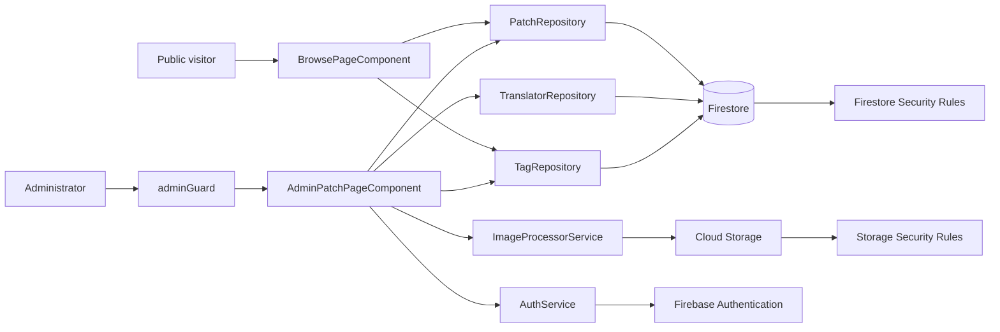

# Design — Thai Game Patch Database

> Status: **Phase 2 complete — ready for task planning.**
> Requirements: `docs/thai-game-patch-database/requirements.md`

## Overview

The application is an Angular 16+ static SPA deployed to GitHub Pages. It reads public patch and master data directly from Firestore, performs the browse-page search and tag filter in local Angular state, and stores optimized JPEG covers in Firebase Cloud Storage. Google Sign-In establishes the user identity; a Firestore `admins/{uid}` allowlist and matching Firebase Security Rules authorize all mutation. A route guard is a UX boundary only—the Firebase rules remain the authorization boundary.

## Architecture



### Application layers

| Layer | Responsibility |
|---|---|
| Angular Router | Maps `/` to public browsing and `/add-patch` / `/admin` to the protected administration screen. Configure the GitHub Pages base href during build. |
| Page and presentational components | Render public table/cards, filters, sign-in state, and reactive admin forms. Keep Firebase calls out of templates and presentational components. |
| Repositories | Encapsulate Firestore collection access and DTO mapping. Return observable streams or signals that pages consume. |
| Auth and guard | Starts Google sign-in, exposes auth state and admin status, and blocks protected routes when either is absent. |
| Image processor | Converts a selected or clipboard image to a maximum-250px JPEG blob before any Storage upload begins. |
| Firebase | Authentication identifies users; Firestore holds data and the admin allowlist; Storage holds processed covers. Rules independently enforce access. |

### Visual system

The interface uses a readable late-1990s game-archive treatment: deep navy ink, dark panels, and acid-lime as the single primary action color. Tailwind CSS provides the component utility layer; `tailwind.config.js` owns shared colors and the `rd` font utility while `src/styles.css` owns the local `RD Chulajaruek` font-face, global focus, and reduced-motion defaults. `AppComponent` owns the persistent header, desktop system menu, and an `aria-live` global message region. Pages use the `StatusMessageService` to publish concise info or error messages without creating ad-hoc alerts.

The layout starts as a compact single-column mobile surface and adds an 8.5rem black system-selection rail at Tailwind's `lg` breakpoint. The rail uses subtle geometric linework, directional link markers, a pale divider, and a deep blue content pane, inspired by late-1990s game microsites without reproducing third-party branding. It currently exposes All systems, 3DS, GBA, NDS, and PSP; its selected state is intentionally ready to connect to the dynamic system filter in the browse-data task. Keyboard focus is always a high-contrast pink outline, and motion is disabled for users who prefer reduced motion.

The temporary browse showcase uses a mobile-first card mode: a beveled search console, horizontally scrollable category chips, and one high-contrast patch card at a time. Each card has a locally rendered mock cover, platform badge, title, translator, metadata, tags, and a download action. The final `PatchCardListComponent` will replace this showcase structure while preserving those required fields and replacing mock covers with `Patch.coverUrl`.

### Routes

| Path | Component | Access |
|---|---|---|
| `/` | `BrowsePageComponent` | Public |
| `/add-patch` | `AdminPatchPageComponent` | `adminGuard` |
| `/admin` | Redirect to `/add-patch` | `adminGuard` |
| `**` | Redirect to `/` | Public |

## Components and Interfaces

### Domain DTOs

```ts
export interface Translator {
  id: string;
  name: string;
  link?: string;
}

export interface Tag {
  id: string;
  name: string;
}

export interface Patch {
  id: string;
  createDate: string;
  fileName: string;
  gameTitle: string;
  system: string;
  translatorId: string;
  translatedBy: string;
  patchTool: string;
  tags: string[];
  coverUrl: string;
  patchFileUrl: string;
}

export interface AdminProfile {
  uid: string;
  email: string;
}

export interface PatchDraft {
  fileName: string;
  gameTitle: string;
  system: string;
  translatorId: string;
  patchTool: string;
  tags: string[];
  patchFileUrl: string;
  coverFile?: File;
}

export interface ProcessedCover {
  blob: Blob;
  filename: string;
  width: number;
  height: number;
}
```

### Repository and service contracts

```ts
export abstract class PatchRepository {
  abstract watchAll(): Observable<Patch[]>;
  abstract getById(id: string): Promise<Patch | undefined>;
  abstract create(draft: PatchDraft, coverUrl: string): Promise<string>;
  abstract update(id: string, draft: PatchDraft, coverUrl?: string): Promise<void>;
}

export abstract class TranslatorRepository {
  abstract watchAll(): Observable<Translator[]>;
  abstract create(name: string, link?: string): Promise<Translator>;
}

export abstract class TagRepository {
  abstract watchAll(): Observable<Tag[]>;
  abstract create(name: string): Promise<Tag>;
}

export abstract class AuthService {
  abstract readonly user: Signal<User | null>;
  abstract readonly isAdmin: Signal<boolean>;
  abstract signInWithGoogle(): Promise<void>;
  abstract signOut(): Promise<void>;
}

export abstract class ImageProcessorService {
  abstract process(source: Blob): Promise<ProcessedCover>;
}

export const adminGuard: CanActivateFn = (): boolean | UrlTree | Observable<boolean | UrlTree> => { /* implementation */ };
```

`PatchRepository.create` resolves the selected `translatorId` to its master record and writes its current `name` to `translatedBy` in the same patch document. The caller never supplies a free-text `translatedBy` value, preserving the master-data contract. `update` preserves `coverUrl` when no new image is supplied.

### UI components

| Component | Inputs / outputs | Responsibility |
|---|---|---|
| `AppComponent` | none | Router shell, retro visual theme, global status region. |
| `BrowsePageComponent` | none | Maintains keyword, tag, translator, system, sort-field, and sort-direction signals; derives the visible patches from one loaded patch stream. |
| `PatchTableComponent` | `@Input() patches: Patch[]` | Desktop table and download links. |
| `PatchCardListComponent` | `@Input() patches: Patch[]` | Mobile cards with essential fields and download button. |
| `TagFilterComponent` | `@Input() tags: Tag[]`; `@Output() selected = EventEmitter<string \| null>` | Dynamic tag buttons and clear action. |
| `GameListControlsComponent` | `@Input() translators: Translator[]`; `@Input() systems: string[]`; `@Output() filtersChanged = EventEmitter<GameListFilters>` | Keyword input, tag selection, translator/system filters, sort field, and sort direction controls. |
| `AdminPatchPageComponent` | none | Reactive add/edit form, loads masters, invokes inline creation and submit workflow. |
| `TranslatorInlineCreateComponent` | `@Output() created = EventEmitter<Translator>` | Validates and creates a translator without leaving the form. |
| `TagInlineCreateComponent` | `@Output() created = EventEmitter<Tag>` | Validates and creates a tag without leaving the form. |
| `CoverInputComponent` | `@Output() selected = EventEmitter<Blob>` | Handles file selection, paste events, preview, and processing errors. |

### State and data flow

1. `BrowsePageComponent` subscribes once to `PatchRepository.watchAll()`, `TagRepository.watchAll()`, and `TranslatorRepository.watchAll()` when it loads.
2. It stores the returned values in signals. A computed `systems` signal derives a unique, normalized list of available `Patch.system` values. A computed `visiblePatches` signal applies the keyword, selected tag, selected translator ID, and selected system predicates using AND logic, then sorts the result according to the selected field and direction.
3. CSS media queries choose the table or card component. Both receive the same computed patch array.
4. The admin page loads the master streams, uses a reactive form, validates it locally, and processes a new image before calling Storage.
5. The page obtains the `coverUrl` after a successful upload, then creates or updates the Firestore patch document. A failed upload does not trigger a patch write.

## Data Models

### Firestore collections

| Collection | Document ID | Fields | Use |
|---|---|---|---|
| `admins` | Firebase Auth UID | `email` | Explicit allowlist used by client admin-state lookup and security rules. Documents are provisioned outside the public app by the project owner. |
| `translators` | Auto ID | `name`, `link?` | Translator/team master data. |
| `tags` | Auto ID | `name` | Category-tag master data. |
| `patches` | Auto ID | `fileName`, `gameTitle`, `system`, `translatorId`, `translatedBy`, `patchTool`, `tags`, `coverUrl`, `patchFileUrl` | Public patch repository. |

### Cloud Storage layout

| Path | Content | Rule intent |
|---|---|---|
| `covers/{patchId}/cover_max250px_<timestamp>.jpg` | One processed JPEG cover per upload | Public read; only an approved admin may write or delete. |

The Firestore patch ID is allocated before Storage upload so the cover can be written beneath a stable patch path. If the image upload fails, the allocated Firestore document is not created. For a new patch with no cover selected, `coverUrl` is stored as an empty string and the public UI shows a deliberate placeholder; the form may make a cover required later only if requirements change.

### Join/reference chain

```text
patches.translatorId ──> translators/{id}
patches.translatedBy ──> denormalized translators/{id}.name at save time
patches.tags[] ────────> tag names from tags collection at save time
patches.coverUrl ──────> Cloud Storage covers/{patchId}/...
admins/{request.auth.uid} ──> authorization for Firestore / Storage writes
```

`translatedBy` is intentionally denormalized for display and local keyword search. The admin form must re-resolve the selected translator master record on every save. Tags are stored as names because the supplied source schema specifies an array of strings; their selection must be limited to master records.

### Browse-list controls and comparison rules

```ts
export type GameListSortField = 'gameTitle' | 'translatedBy' | 'system' | 'createDate';
export type SortDirection = 'asc' | 'desc';

export interface GameListFilters {
  keyword: string;
  tag: string | null;
  translatorId: string | null;
  system: string | null;
  sortBy: GameListSortField;
  sortDirection: SortDirection;
}
```

The default sort is `createDate` descending in the current showcase. Date sorting compares ISO-8601 `createDate` values chronologically; text fields use trimmed Thai-locale, case-insensitive comparison. Equal primary values use `Patch.id` as a deterministic tie-breaker. The translator filter uses `translatorId` rather than the denormalized display name, while the system filter uses exact equality after normalization.

### Queries

The public patch list is read once as a stream, then filtering occurs in memory. Master collections are read once as streams and sorted by normalized `name` in the client. This design deliberately avoids a Firestore query per typed character or tag click. The patch data model intentionally does not include `createdAt` or `updatedAt`, so it does not promise chronological ordering.

Until the Firestore repository is connected, `src/app/mock-data/mock-patches.ts` provides three schema-conformant display records solely for the browse-page foundation. It must be replaced by `PatchRepository.watchAll()` in Task 4.1; it is never a Firestore write source.

## Image processing algorithm

1. Receive an image blob from file input or clipboard, and reject non-image MIME types.
2. Decode it in the browser and calculate `scale = min(1, 250 / width, 250 / height)`.
3. Draw the scaled image to a canvas using dimensions rounded to positive integers.
4. Export `canvas.toBlob` as `image/jpeg` with a documented compression setting (initial implementation: `0.82`).
5. Create the filename `cover_max250px_<Date.now()>.jpg`, show the result as a local preview, then upload only that JPEG blob.

## Authorization and Security Rules

The web client checks `admins/{uid}` after authentication to provide an understandable access denial. Security rules repeat the same check and are authoritative; hiding an interface never substitutes for a rule.

```text
isAdmin() := request.auth != null
             && exists(/databases/$(database)/documents/admins/$(request.auth.uid))
```

| Resource | Read | Create / update / delete |
|---|---|---|
| `patches`, `translators`, `tags` | Anyone | `isAdmin()` only |
| `admins` | Owner may read own profile (or client exposes only an admin-claim endpoint) | Provisioning only; deny public-app writes |
| `covers/**` | Anyone | `isAdmin()` only |

Rules should also validate basic document shape on writes: non-empty string fields required by the form, `tags` is an array of strings, `translatorId` references an existing translator, `translatedBy` matches that translator name, and `coverUrl` points to the approved cover path or is empty. The exact Firestore Rules syntax belongs in implementation, but the acceptance gate is that direct unauthorized SDK requests fail even if a user bypasses the UI.

The deployable Firestore rules are maintained in the repository root at `firestore.rules`; administrator documents are intentionally read-only to the public application and must be provisioned out-of-band.

The deployable Cloud Storage rules are maintained in the repository root at `storage.rules`. Public reads are limited to `covers/{patchId}/{filename}`; writes require an allowlisted admin, JPEG content, a two-megabyte size ceiling, and the processed-cover filename convention. `firebase.json` wires both rule files for Firebase CLI deployment.

## Correctness Properties

| ID | Property | Requirement references |
|---|---|---|
| CP-1 | The visible patch set is exactly the intersection of the local keyword predicate (game title, file name, system, translator), optional selected-tag predicate, optional selected-translator-ID predicate, and optional selected-system predicate. | 2.1–2.5, 3.3, 9.4–9.8 |
| CP-2 | A saved patch's `translatorId`, `translatedBy`, and `tags` originate from selected master records; `translatedBy` equals the selected translator's current name at save time. | 5.1–5.7, 6.3 |
| CP-3 | Every uploaded cover is a JPEG whose width and height are each at most 250 pixels, and `coverUrl` is saved only after its corresponding Storage upload succeeds. | 1.4, 7.3–7.7 |
| CP-4 | The same computed patch array feeds both the desktop table and mobile card view, so responsive layout cannot change filtering or sorting results. | 1.2–1.5, 3.1–3.3, 9.9 |
| CP-5 | A Firestore or Storage mutation succeeds only when Firebase rules can prove the requester is an allowlisted administrator; the route guard does not grant authorization by itself. | 4.1–4.4, 8.3–8.5 |
| CP-6 | Keyword, tag, translator, system, and sort interactions do not issue a new Firestore read after the initial live streams have loaded, unless the underlying collection changes. | 2.1, 2.3–2.5, 8.7, 9.1–9.8 |
| CP-7 | A selected sort compares only its specified display field in the requested direction, with `Patch.id` as a deterministic tie-breaker. | 9.1–9.3 |

## Error Handling

| Scenario | Detection | Expected user behavior |
|---|---|---|
| No patch records | Patch stream returns an empty array | Show an empty-state message; retain search and tag controls. |
| No tags or translators | Master stream returns empty | Public page hides/disables unavailable tag options; admin page explains that a first master item can be created inline. |
| Invalid form data | Reactive validators fail | Keep form data visible, prevent submit, and identify each invalid required field. |
| Clipboard does not contain an image | Paste handler finds no image item | Ignore non-image content and show a concise image-only hint. |
| Unsupported/corrupt image or canvas failure | Decode/export fails | Preserve the form, remove invalid preview, and show a retryable error. |
| Cloud Storage upload fails | Upload promise rejects | Show upload error; do not create/update the patch with a new invalid cover URL. |
| Firestore write fails | Repository promise rejects | Show save error; retain form values for retry and do not falsely show success. |
| Authentication popup cancelled/fails | Google sign-in rejects | Remain on a public route and show a retryable sign-in error. |
| Signed-in non-admin opens admin URL | `adminGuard` returns denial | Redirect to `/` and show an access-denied notification. |
| Firebase unavailable / permission denied | Stream or mutation error | Show a non-technical unavailable/permission error and offer retry; never expose raw Firebase errors as the only message. |
| Broken cover or patch download URL | Browser load/navigation failure | Display cover placeholder on image error; download link remains clearly labelled as external. |

## Verification

Manual verification is the primary acceptance gate.

- [ ] Open `/` while signed out; confirm the patch list and tag filter load, while `/add-patch` and `/admin` are blocked.
- [ ] Confirm the public list displays all available patch documents without requiring timestamp fields.
- [ ] Search independently by game title, file name, platform, and translator; combine each search with a tag, then clear each filter.
- [ ] Select each sort field and both sort directions; confirm game title, translator/team, and system/platform values follow the configured Thai-locale comparison and equal values use the document-ID tie-breaker.
- [ ] Select translator/team and system/platform filters independently and together with keyword/tag filters; confirm only records matching every active filter remain, and clearing one filter preserves the others.
- [ ] Confirm translator options come from the translators master collection and system options are the unique values currently available in patch records.
- [ ] Confirm keyword typing and tag selection do not produce new Firestore reads after the initial data has loaded (using Firebase emulator/logging or browser network tools).
- [ ] Check desktop table headers and values against a known patch document; verify its download URL opens.
- [ ] Resize to the mobile breakpoint and confirm cards show only the required essential fields while returning the same filtered records as desktop.
- [ ] Sign in with an allowlisted Google account and confirm both protected paths enter the administration UI.
- [ ] Sign in with a non-allowlisted account and confirm the guard blocks UI access and direct Firestore/Storage mutation attempts are rejected.
- [ ] Create a translator with and without an external link, and a tag; verify each is immediately selectable and stored in its master collection.
- [ ] Create and update a patch; verify its master references, denormalized translator name, and tag array in Firestore, with no `createdAt` or `updatedAt` fields written.
- [ ] Test a file-selected cover and a clipboard-pasted cover with portrait, landscape, and square inputs; inspect resulting JPEG MIME type, filename convention, and dimensions not exceeding 250px.
- [ ] Simulate invalid fields, failed image processing, failed upload, and denied write; confirm errors retain user-entered form data and no invalid patch data is persisted.
- [ ] Deploy the production build to GitHub Pages and verify direct navigation, refresh, Firebase configuration, and responsive styling at the published site URL.

Automated tests may be added in Phase 4 only if an Angular test project is introduced; prioritize unit tests for image scale calculation, filter predicate, and route guard decision, plus Firebase Emulator rule tests.
